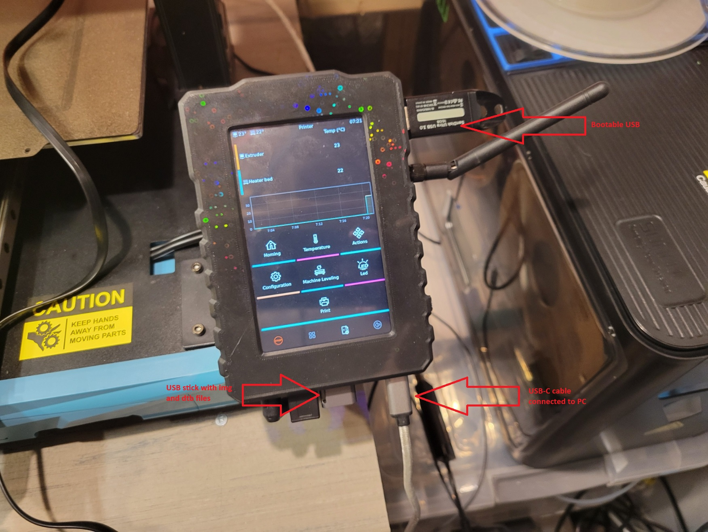

# How to update SV07/SV07+ to Debian Bookworm and flash latest firmware on the MCU.

Tools and software needed:
1. 2 x 8 gig or more USB Stick (can be done with one USB stick, but this guide assumes 2, as I did it with 2 before I figured I could only use one)
2. Latest release of [unofficial Armbian for MKSPI](https://github.com/redrathnure/armbian-mkspi/releases) (bookworm current or edge)
3. Sovol's compiled dtb directly from their release image (/boot/dtb/rockchip/rk3328-roc-cc.dtb) or use the one I uploaded to [this repository](https://github.com/vasyl83/sv7update/blob/main/rk3328-roc-cc.dtb).
4. Computer (or laptop) with a free USB slot
5. Cable to connect you computer (or laptop) to USB-C port on the klipad, so USB-A to USB-C or USB-C to USB-C

This guide assumes that you have the default Sovol image flashed on the klipad, it doesn't matter what firmware version nor if it boots properly or is in a boot loop.

## 1. Preparing USB sticks
Download [Balena Etcher portable and run it](https://etcher.balena.io/#download-etcher)

Click "Flash from file" and select the image you downloaded (I will be using Armbian-unofficial_24.2.0-trunk_Mkspi_bookworm_current_6.6.17.img.xz as example)

Click "Select target" and point it to USB stick

Click Select 1. Then wait for it to finish.

Afterwards extract the .xz file into .img and copy that file to the second USB stick as well as rk3328-roc-cc.dtb

The contents of the second USB should look like this:

## 2. Plugging everyhting into the printer.

Now connect both USBs and your PC into the KliPad.

On you computer Open up Device Manager and expand Ports (COM & LTP). You should see USB-SERIAL CH340 followed by a COM port number (take note ot if, in my case its COM3):

Start up [PuTTY](https://www.chiark.greenend.org.uk/~sgtatham/putty/latest.html)

Input the following settings:
1. Conenction type: Serial
2. Serial line: COM3 (or whatever COM Device Manager shows)
3. Speed: 1500000

Click Open, you should now see a blank black window, press Enter a few times untill you see a login prompt:

Enter the username and password you use (defaults are user:mks password:makerbase)

halt the system:
`sudo halt`

## 3. Booting from USB

Make sure that the KliPad screen in blank, PuTTY window should remain like this (what you see shouldn't be exactly the same, only the result of the command should be the same):

Now simultaniously hold spacebar on your PC and press the power button on the KliPad (the small one on the right side of the screen) for about 10 seconds. Once you release the button you should see text scrolling on PuTTY window, once it stops scrolling, the last line should say `Hit any key to stop autoboot:  0` and you see the cursor adding spaces, release the spacebar, it should look something like this:

Delete all the spaces and type in:
`run bootcmd_usb0`

It will now boot from the USB.

once the boot it completed you should see on the screen a line `mkspi login: root (automatic login)`

Once it finishes booting you will be prompted to create root password, enter anything. Select your prefered shell (I use zsh), and once it asks you to create a new user, press Ctrl-C to abort and drop into the shell. You are now booted into USB.

## 4. Flashing new image onto EMMC
